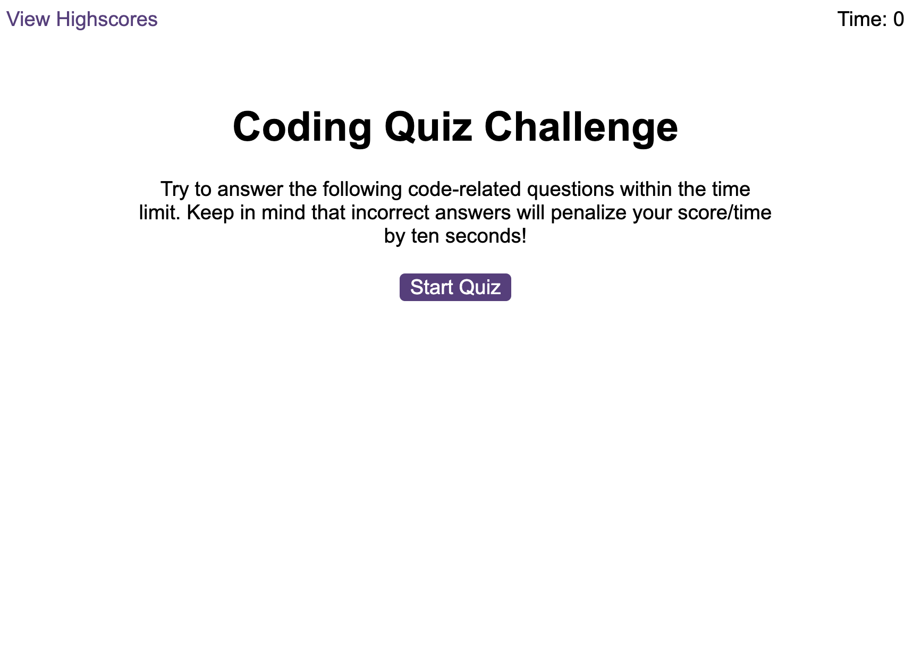
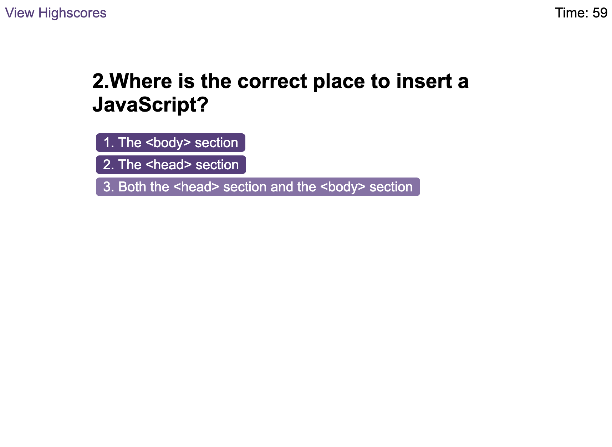
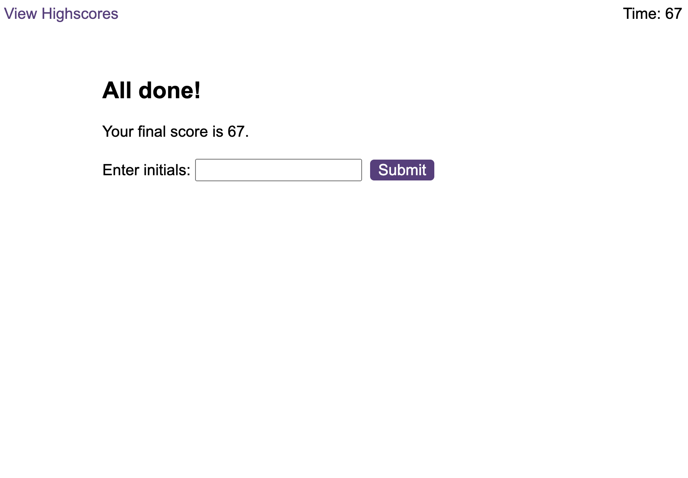
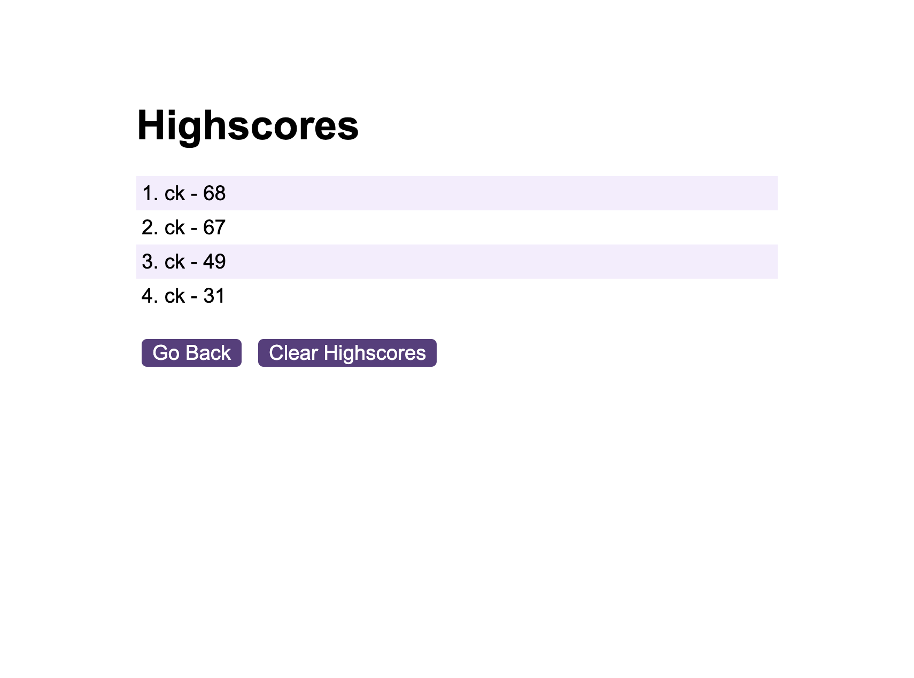
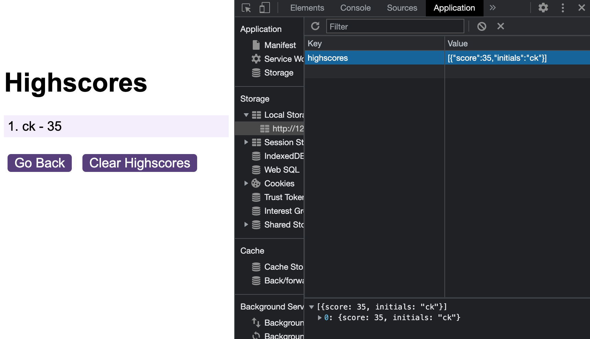
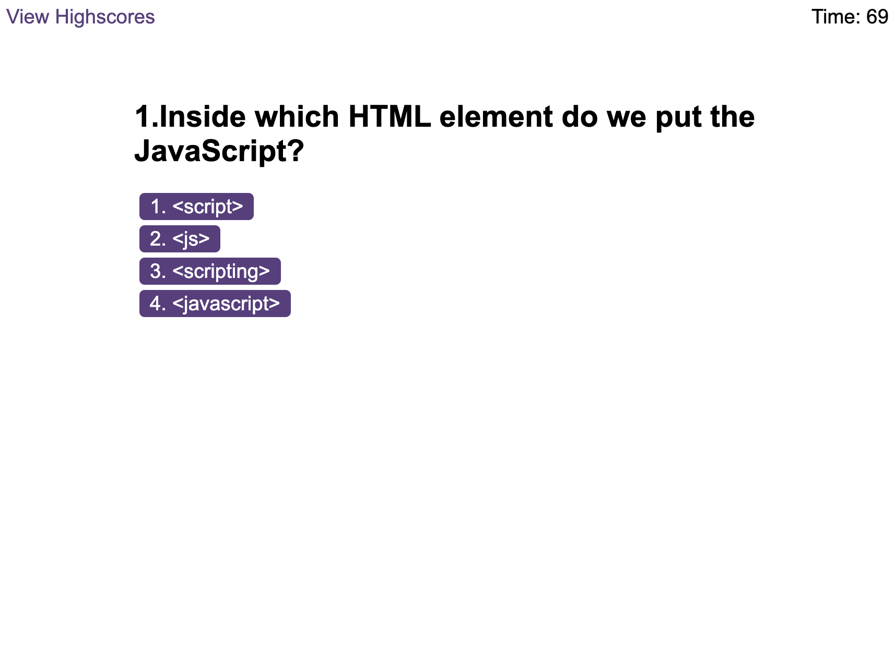

# quiz-time

This is my attempt at building the code quiz task set in week 6 of my front end web development bootcamp

## Description

In this challenge i had to use Javascript to create a quiz that contained a countdown timer when the quiz began. it would then deduct time from the countdown if you answered a question wrong. At the end of the quiz you would then enter your initials and save your results to the local storage.

To begin I created my relevant js. files and started outlining my pseudocode to breakdown what i wanted to do. Firstly i created my questions array that contained objects that contained a question, choices and an answer.

I then worked on the logic js. file that would contain most of my code. I started by creating variables for some of the buttons that i needed to be clickable so that i could add event listeners. i then started with the easiest task which was to make sure that the countdown timer started once the "start quiz" button was clicked, and that the start screen would be hidden.

Once i had done this i started by creating my 'displayQuestions' function. During this process i got a little confused so i had to use the speed run to help me complete this task.

while completing the task i found myself abit confused however i experimented with the code and found myself unerstanding it more as i was breaking it down and testing out individual pieces of code.

I did struggle near the end of the task and had to rely on the speed run to complete the highscores.js and the saveScore function. During the commenting of these tasks i researched what the code was doing and found that i was able to understand how it worked but at this stage i am not confident that i would be able to write this code by myself just yet.

## Table of Contents

- [Installation](#installation)
- [Screenshots](#screenshots)
- [License](#license)

## Installation

No need to install anything to view this project; you can view it [here](https://chriskeno95.github.io/quiz-time/)

## Screenshots

## License

MIT licence

---

© 2022 edX Boot Camps LLC. Confidential and Proprietary. All Rights Reserved.
